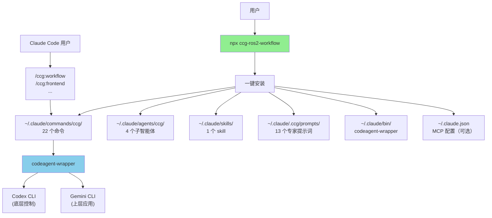

# CCG-ROS2 Multi-Model Collaboration System

> ROS2 多模型协作开发工作流

**Last Updated**: 2026-01-27 (v2.0.0)

---

## 变更记录 (Changelog)

### 2026-01-27 (v2.0.0)
- 🚀 **架构重构**：Fork 官方 ccg-workflow v1.7.54，完整对齐 TypeScript + ESM 基础设施
- 🤖 **ROS2 特化**：领域术语从 前端/后端 改为 上层应用/底层控制
- 📦 **包名变更**：`ccg-workflow` → `ccg-ros2-workflow`
- 🔄 **Agent 替换**：`ui-ux-designer` → `system-integrator`（ROS2 系统集成设计师）
- ➕ **7 阶段工作流**：新增硬件部署阶段
- 🎯 **目标平台**：ROS2 Humble / 物理机器人

---

## 模块职责

**CCG-ROS2 (Claude + Codex + Gemini)** - ROS2 多模型协作系统的核心实现，提供：

1. **多模型协作编排**：固定路由 Gemini（上层应用）+ Codex（底层控制）+ Claude（编排）
2. **22 个斜杠命令**：ROS2 开发工作流 + Git 工具 + 项目管理 + OpenSpec
3. **13 个专家提示词**：Codex 6 个 + Gemini 7 个
4. **跨平台 CLI 工具**：一键安装（支持 macOS、Linux、Windows）
5. **MCP 集成**：ace-tool 可选配置（代码检索 + Prompt 增强）

---

## 入口与启动

### 用户安装入口

```bash
# 一键安装（推荐）
npx ccg-ros2-workflow

# 交互式菜单
npx ccg-ros2-workflow menu
```

### CLI 入口点

- **主入口**：`bin/ccg.mjs` → `src/cli.ts`
- **核心命令**：
  - `init` - 初始化工作流（`src/commands/init.ts`）
  - `update` - 更新工作流（`src/commands/update.ts`）
  - `menu` - 交互式菜单（`src/commands/menu.ts`）
  - `diagnose-mcp` - MCP 诊断（`src/commands/diagnose-mcp.ts`）
  - `config` - 配置管理（`src/commands/config-mcp.ts`）

### codeagent-wrapper 入口

- **主入口**：`codeagent-wrapper/main.go`
- **调用语法**：
  ```bash
  codeagent-wrapper --backend <codex|gemini|claude> - [工作目录] <<'EOF'
  <任务内容>
  EOF
  ```

---

## 对外接口

### CLI 命令接口

| 命令 | 用途 |
|------|------|
| `npx ccg-ros2-workflow` | 一键安装/菜单 |
| `npx ccg-ros2-workflow menu` | 交互式菜单 |
| `npx ccg-ros2-workflow update` | 更新到最新版本 |
| `npx ccg-ros2-workflow diagnose-mcp` | 诊断 MCP 配置 |

### Slash Commands 接口（22 个）

**ROS2 开发工作流**：
| 命令 | 用途 | 模型 |
|------|------|------|
| `/ccg:workflow` | 完整 7 阶段工作流（含硬件部署） | Codex ∥ Gemini |
| `/ccg:plan` | 多模型协作规划（Phase 1-2） | Codex ∥ Gemini |
| `/ccg:execute` | 多模型协作执行（Phase 3-5） | Codex ∥ Gemini + Claude |
| `/ccg:frontend` | 上层应用专项（Launch/Python/RViz） | Gemini |
| `/ccg:backend` | 底层控制专项（C++/驱动/实时） | Codex |
| `/ccg:feat` | 智能功能开发 | 规划 → 实施 |
| `/ccg:analyze` | 技术分析（仅分析） | Codex ∥ Gemini |
| `/ccg:debug` | 问题诊断 + 修复 | Codex ∥ Gemini |
| `/ccg:optimize` | 性能优化 | Codex ∥ Gemini |
| `/ccg:test` | 测试生成 | 智能路由 |
| `/ccg:review` | 代码审查（自动 git diff） | Codex ∥ Gemini |

**OpenSpec 规范驱动**：
| 命令 | 用途 |
|------|------|
| `/ccg:spec-init` | 初始化 OpenSpec 环境 |
| `/ccg:spec-research` | 需求研究 → 约束集 |
| `/ccg:spec-plan` | 多模型分析 → 零决策计划 |
| `/ccg:spec-impl` | 规范驱动实现 |
| `/ccg:spec-review` | 归档前双模型审查 |

**项目管理**：
| 命令 | 用途 |
|------|------|
| `/ccg:init` | 初始化项目 CLAUDE.md |

**Git 工具**：
| 命令 | 用途 |
|------|------|
| `/ccg:commit` | 智能提交（conventional commit） |
| `/ccg:rollback` | 交互式回滚 |
| `/ccg:clean-branches` | 清理已合并分支 |
| `/ccg:worktree` | Worktree 管理 |

---

## 固定配置

v2.0.0 起，以下配置为 ROS2 特化：

| 项目 | 固定值 | 原因 |
|------|--------|------|
| 语言 | 中文 | 所有模板为中文 |
| 上层应用模型 | Gemini | 擅长 Launch/Python/RViz |
| 底层控制模型 | Codex | 擅长 C++/驱动/实时算法 |
| 协作模式 | smart | 最佳实践 |
| ROS2 版本 | Humble | LTS 版本 |
| 目标平台 | 物理机器人 | 默认配置 |

---

## 关键依赖与配置

### TypeScript 依赖

**运行时依赖**：
- `cac@^6.7.14` - CLI 框架
- `inquirer@^12.9.6` - 交互式提示
- `ora@^9.0.0` - 加载动画
- `ansis@^4.1.0` - 终端颜色
- `fs-extra@^11.3.2` - 文件系统工具
- `smol-toml@^1.4.2` - TOML 解析

**开发依赖**：
- `typescript@^5.9.2`
- `unbuild@^3.6.1` - 构建工具
- `tsx@^4.20.5` - TypeScript 执行器

### Go 依赖

- Go 标准库（无外部第三方依赖）

### 配置文件

**用户配置**：
- `~/.claude/.ccg/config.toml` - CCG-ROS2 主配置

**MCP 配置**：
- `~/.claude.json` - Claude Code MCP 服务配置

---

## 相关文件清单

### 核心源码

```
src/
├── cli.ts                     # CLI 入口
├── cli-setup.ts               # 命令注册
├── commands/
│   ├── init.ts                # 初始化命令
│   ├── update.ts              # 更新命令
│   ├── menu.ts                # 交互式菜单
│   └── ...
├── utils/
│   ├── installer.ts           # 安装逻辑（核心）
│   ├── config.ts              # 配置管理
│   ├── mcp.ts                 # MCP 工具集成
│   └── ...
```

### 模板文件

```
templates/
├── commands/                  # 22 个斜杠命令
│   ├── workflow.md            # 7 阶段 ROS2 工作流
│   ├── plan.md                # 多模型协作规划
│   ├── execute.md             # 多模型协作执行
│   ├── frontend.md            # 上层应用专项
│   ├── backend.md             # 底层控制专项
│   ├── feat.md
│   ├── analyze.md
│   ├── debug.md
│   ├── optimize.md
│   ├── test.md
│   ├── review.md
│   ├── init.md
│   ├── commit.md
│   ├── rollback.md
│   ├── clean-branches.md
│   ├── worktree.md
│   ├── spec-init.md           # OpenSpec 系列
│   ├── spec-research.md
│   ├── spec-plan.md
│   ├── spec-impl.md
│   ├── spec-review.md
│   └── agents/                # 4 个子智能体
│       ├── planner.md         # ROS2 任务规划师
│       ├── system-integrator.md  # ROS2 系统集成设计师（替代 ui-ux-designer）
│       ├── init-architect.md
│       └── get-current-datetime.md
├── prompts/                   # 13 个专家提示词
│   ├── codex/                 # 底层控制角色
│   └── gemini/                # 上层应用角色
└── skills/                    # 1 个 skill
    └── multi-model-collaboration/
```

### 预编译产物

```
bin/
├── ccg.mjs                           # CLI 入口脚本
├── codeagent-wrapper-darwin-amd64    # macOS Intel
├── codeagent-wrapper-darwin-arm64    # macOS Apple Silicon
├── codeagent-wrapper-linux-amd64     # Linux x64
├── codeagent-wrapper-linux-arm64     # Linux ARM64
├── codeagent-wrapper-windows-amd64.exe  # Windows x64
└── codeagent-wrapper-windows-arm64.exe  # Windows ARM64
```

---

## 架构图



---

## NPM 发布流程

```bash
# 1. 更新版本号
# 编辑 package.json

# 2. 构建并发布
pnpm build
npm publish

# 3. 提交到 Git
git add -A
git commit -m "chore: bump version to x.y.z"
git push origin main
```

---

**扫描覆盖率**: 95%+
**最后更新**: 2026-01-27
